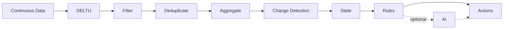
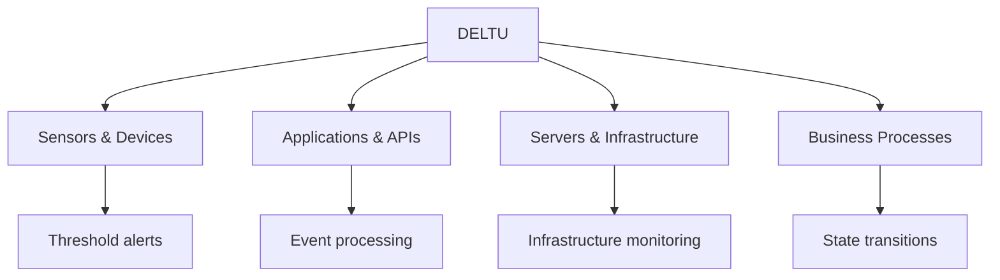
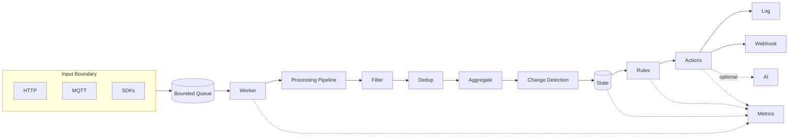

A lightweight, local-first event-processing engine in Rust that turns continuous data into **meaningful events, state, rules, and actions**.

Deltu sits between your data sources and the logic that needs to react to them.

```text
Data → Filter → Deduplicate → Aggregate → Change → State → Rules → Actions
```

**No cloud required. No database required. No AI required. One small binary.**

### Why DELTU?

* **Fast** — built in Rust for efficient continuous processing
* **Local-first** — run it on a server, edge device, or Raspberry Pi
* **Bounded** — explicit limits on queues, caches, windows, and state
* **Deterministic** — predictable processing without hidden background behavior
* **AI optional** — use AI only when deterministic processing is not enough
* **Developer-first** — HTTP, MQTT, Python, TypeScript, CLI, webhooks

### At a glance

|                      |                                            |
| -------------------- | ------------------------------------------ |
| ⚡ **≈77k events/s**  | Dev-build loopback benchmark               |
| 🦀 **Rust**          | Small, efficient runtime                   |
| 📦 **Single binary** | No runtime dependency stack                |
| 🌍 **Local-first**   | No telemetry / no cloud dependency         |
| 🔌 **HTTP + MQTT**   | Connect applications, devices, and sensors |
| 🧠 **AI optional**   | Never required for the core engine         |

---

## See DELTU in action

```text
Continuous data
       ↓
temperature: 72
temperature: 74
temperature: 81
temperature: 86
       ↓
   STATE CHANGE
       ↓
  RULE MATCHED
       ↓
 WEBHOOK FIRED ✓
```

Run the complete demo:

```bash
./examples/demo.sh 8211
```

Or build from source:

```bash
cargo run --release -- run
```

Then send an event:

```bash
curl -X POST http://127.0.0.1:8080/v1/events \
  -H 'content-type: application/json' \
  -d '{
    "events": [{
      "id": "e1",
      "source": "sensor-1",
      "kind": "temperature",
      "timestamp": 1700000000000,
      "payload": {
        "type": "numeric",
        "value": 86
      }
    }]
  }'
```

---

## The problem

Applications continuously produce data.

Sensors produce readings.
APIs produce events.
Servers produce metrics.
Devices produce state changes.
Business systems produce transactions.

Most applications then end up implementing the same plumbing:

```text
filter
deduplicate
aggregate
detect changes
maintain state
evaluate rules
trigger actions
```

DELTU provides that runtime as one small, self-hostable engine.

### The principle

> **Process data first. Use AI only when necessary.**

If deterministic code can understand the event, let deterministic code handle it.

AI can be connected when a decision actually requires it.

---

## What DELTU does



The core engine does not require AI.

It does not require Kubernetes.

It does not require Kafka.

It does not require Redis.

It does not require a cloud service.

It is designed to be useful by itself.

---

## What can you build?

DELTU is not limited to IoT.



Examples:

* Sensor and telemetry alerts
* Application event processing
* API event reduction
* Infrastructure monitoring
* Device and job state tracking
* Edge and offline-first processing
* Webhook automation
* Event-driven business workflows
* Stateful rules and notifications

---

## Verified numbers

| Metric               |                     Value |
| -------------------- | ------------------------: |
| Ingest throughput    |             ≈77k events/s |
| Latency p95 / p99    |               1 ms / 1 ms |
| Release binary       |                    5.2 MB |
| Cold start → healthy |                   ≈0.65 s |
| Rust tests           |                       166 |
| SDK tests            | 12 Python + 12 TypeScript |
| AI required          |                        No |
| Cloud required       |                        No |

Benchmarks are environment-dependent; see the benchmark documentation for methodology.

---

## Quick start

### 1. Install

**Release binary**

```bash
# Download from GitHub Releases
deltu run
```

**From source**

```bash
cargo run --release -- run
```

**Docker**

```bash
docker build -t deltu:local .

docker run -d \
  -p 8080:8080 \
  deltu:local run
```

### 2. Check the engine

```bash
curl http://127.0.0.1:8080/health
```

### 3. Send an event

```bash
curl -X POST http://127.0.0.1:8080/v1/events \
  -H 'content-type: application/json' \
  -d '{
    "events": [{
      "id": "e1",
      "source": "sensor-1",
      "kind": "door.state",
      "timestamp": 1700000000000,
      "payload": {
        "type": "text",
        "value": "open"
      }
    }]
  }'
```

### 4. Inspect the engine

```bash
curl http://127.0.0.1:8080/v1/status | python3 -m json.tool
```

---

## Inputs

* HTTP
* MQTT
* Python SDK
* TypeScript SDK

## Processing

* Filtering
* Deduplication
* Aggregation
* Change detection
* Stateful processing
* Rules
* Suppression windows

## Actions

* Log
* Webhook
* Optional AI provider

---

## Architecture



The input boundary validates and enqueues events.

The core worker processes them synchronously.

The bounded queue provides the backpressure boundary.

Slow network actions are isolated from the processing pipeline.

---

## Why DELTU?

### Bounded by construction

Queues, caches, windows, and state stores have explicit limits and eviction policies.

### Deterministic core

The processing core is synchronous and clock-free. Wall time enters only at the runtime boundary.

### Failures are observable

A failed webhook or full queue does not silently disappear.

Failures are counted and exposed through the status API.

### AI is optional

The default engine does not require an AI provider.

AI can be introduced only where it provides value.

### One binary

A small Rust runtime that can run on a server, edge machine, or Raspberry Pi.

---

## SDKs

### Python

```python
from deltu import DeltuClient, Event, text
import time

with DeltuClient("http://127.0.0.1:8080") as client:
    client.send_event(
        Event(
            id="e1",
            source="sensor-1",
            kind="door.state",
            timestamp=int(time.time() * 1000),
            payload=text("open"),
        )
    )
```

### TypeScript

```typescript
import { DeltuClient, Event, text } from "@deltu/client";

const client = new DeltuClient("http://127.0.0.1:8080");

await client.sendEvent(
  new Event({
    id: "e1",
    source: "sensor-1",
    kind: "door.state",
    timestamp: Date.now(),
    payload: text("open"),
  })
);
```

---

## HTTP API

| Route             | Purpose                     |
| ----------------- | --------------------------- |
| `POST /v1/events` | Ingest events               |
| `GET /health`     | Health check                |
| `GET /v1/status`  | Runtime status and counters |

Example error:

```json
{
  "success": false,
  "error": {
    "code": "invalid_event",
    "message": "..."
  }
}
```

---

## Configuration

Deltu is configured through `engine.yaml`.

```bash
deltu check --config engine.yaml
```

Validate first.

Then deploy:

```bash
deltu run --config engine.yaml
```

For background operation:

```bash
deltu up --config engine.yaml
```

Inspect:

```bash
deltu status
deltu logs
```

Stop:

```bash
deltu down
```

Full deployment guide: [`docs/deploy.md`](docs/deploy.md)

---

## Development

```bash
cargo test --lib
cargo clippy --all-targets
cargo bench
cargo run --release -- run
```

CI runs formatting, clippy, tests, release builds, and Docker smoke tests.

Release builds publish Linux x86_64, Linux ARM64, and macOS ARM64 artifacts.

---

## Open source

Deltu is licensed under the **Apache License 2.0**.

* [`LICENSE`](LICENSE)
* [`NOTICE`](NOTICE)
* [`CONTRIBUTING.md`](CONTRIBUTING.md)
* [`CODE_OF_CONDUCT.md`](CODE_OF_CONDUCT.md)
* [`SECURITY.md`](SECURITY.md)
* [`TRADEMARKS.md`](TRADEMARKS.md)

The DELTU name and logo are trademarks of ECOCEE; the software itself is Apache-2.0 licensed.

---

## Build with DELTU

Have an interesting use case?

Build something with Deltu and share it.

**Applications · Edge systems · Automation · Infrastructure · Devices · Developer tools**

Open an issue, start a discussion, or submit a pull request.

**DELTU**

> **Make Data Behave.**
