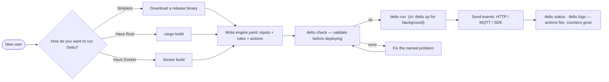
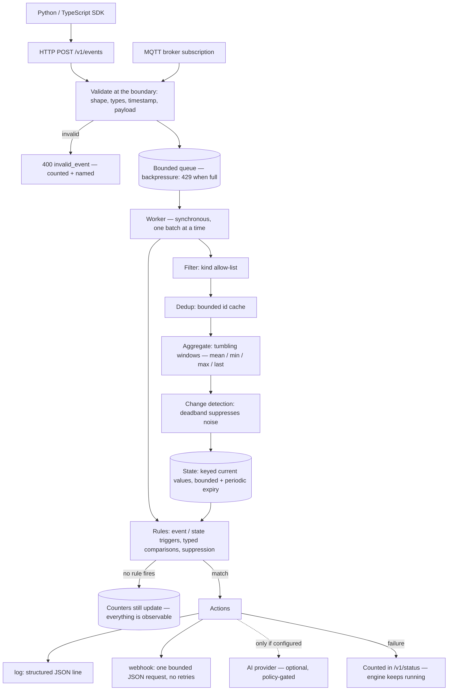
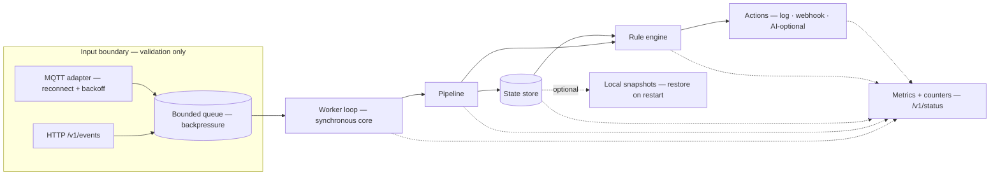
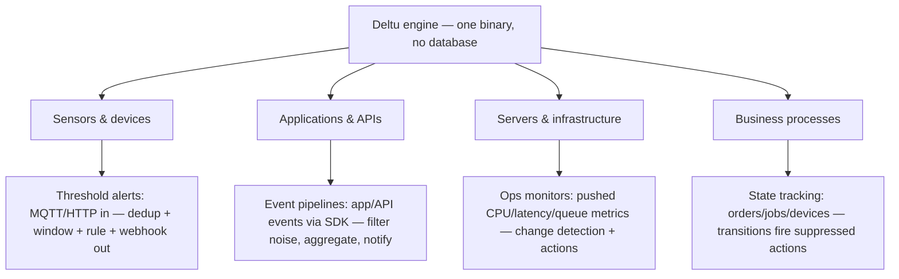

**A small, self-hostable event-processing engine in Rust.** Sensors and
devices stream events in over HTTP or MQTT; Deltu filters, deduplicates,
aggregates, and detects changes — bounded memory, no unbounded growth —
then evaluates rules against current state and fires actions. It runs as
a single binary, on a Raspberry Pi or a server, and never phones home.

Built unit-by-unit against a 14-unit plan (`context/build-plan.md`);
every unit carries its spec, verification results, and commit history
(`context/specs/`, `context/progress-tracker.md`).

## Why Deltu

- **Bounded by construction** — every cache, window, and state store has
  explicit capacity and eviction. No slow leaks, no runaway memory.
- **Deterministic core** — the engine is clock-free and synchronous;
  wall time enters only at the runtime boundary. Testing needs no
  sleeps and no mocks of the clock.
- **Failures are counted, never fatal** — a broken webhook, a full
  queue, a failed snapshot: the engine keeps processing and the
  counter is the alarm.
- **AI is opt-in, not baked in** — a provider boundary with an enforced
  invocation policy; nothing AI compiles into the default build.
- **One binary** — Rust static binary with a distroless container
  option; no runtime dependencies, no telemetry.

## Verified numbers

| Metric | Value |
| --- | --- |
| Ingest throughput (dev build, loopback) | ≈ 77k events/s |
| Latency p95 / p99 (same baseline) | 1 ms / 1 ms |
| Release binary (stripped, Apple Silicon) | 5.2 MB |
| Cold start to healthy | ≈ 0.65 s |
| Rust test suite | 166 tests, clippy clean |
| SDK suites | 12 tests each, incl. live end-to-end |

## Quick start

### 1. Install (pick one path)



**Path A — download a release binary** (no toolchain needed):

```bash
# from https://github.com/ecocee/Deltu/releases
deltu run                              # defaults: 127.0.0.1:8080
```

**Path B — build from source** (needs Rust 1.75+):

```bash
cargo run --release -- run             # binds 127.0.0.1:8080
```

**Path C — Docker**:

```bash
docker build -t deltu:local .
docker run -d -p 8080:8080 deltu:local run
```

### 2. Send your first event and watch it work

```bash
curl -s http://127.0.0.1:8080/health
curl -s -X POST http://127.0.0.1:8080/v1/events \
  -H 'content-type: application/json' \
  -d '{"events":[{"id":"e1","source":"sensor-1","kind":"door.state",
       "timestamp":1700000000000,"payload":{"type":"text","value":"open"}}]}'
curl -s http://127.0.0.1:8080/v1/status | python3 -m json.tool
```

The whole lifecycle from a shell:

```bash
deltu up --config engine.yaml     # start in the background, wait for /health
deltu status                      # live counters
./examples/demo.sh 8211           # send demo events, see rules fire
deltu logs --lines 50             # see the structured action output
deltu down                        # graceful stop
```

Write rules, actions, MQTT and persistence in `engine.yaml`;
`deltu check --config engine.yaml` validates it before deployment.
Full guide: [`docs/deploy.md`](docs/deploy.md).

### How an event flows through Deltu



## Architecture



Processing is synchronous inside one worker; HTTP and MQTT handlers
only validate and enqueue. The bounded queue is the backpressure
boundary — overload answers `429 queue_full`, handlers never process.
Network actions (webhook) run on the blocking pool: a slow receiver
never stalls the pipeline.

| Module | What it does |
| --- | --- |
| `src/event` | Event model + validation (spec 02) |
| `src/processing` | Filter, dedup, aggregation, change detection (spec 03) |
| `src/state` | Keyed current-state store, bounded, expiring (spec 04) |
| `src/rules` | Event/state-triggered rules, suppression windows (spec 05) |
| `src/actions` | Log + webhook actions, pluggable executors (spec 06) |
| `src/runtime` | Config, HTTP API, worker, graceful shutdown (spec 07) |
| `src/input/mqtt` | MQTT adapter: reconnect/backoff, bounded buffering (spec 08) |
| `src/cli` | `run` / `check` / `status` / `health` (spec 09) |
| `src/metrics` | Latency rings, throughput window, `/v1/status` export (spec 10) |
| `src/ai` | Provider trait, policy, usage counters — optional (spec 11) |
| `src/persistence` | Atomic snapshots, historical-sink contract — optional (spec 12) |
| `sdk/python`, `sdk/typescript` | Thin clients over the public v1 API (spec 13) |

## Actions

Two action kinds ship today — both failure-isolated (a broken receiver
never stops the engine; failures are counted in `/v1/status`):

- **`log`** — structured JSON line on stderr.
- **`webhook`** — one bounded JSON POST/PUT/PATCH to your endpoint
  (configurable URL, headers, timeout; no retries):

```yaml
actions:
  - id: notify
    kind:
      type: webhook
      url: https://example.com/hooks/deltu
      timeout_ms: 3000
```

## HTTP API (v1)

| Route | Purpose | Errors |
| --- | --- | --- |
| `POST /v1/events` | Ingest a batch (202 on receipt) | 400 / 413 / 429 / 503 |
| `GET /health` | Liveness | — |
| `GET /v1/status` | Counters, queue depth, metrics, uptime | — |

Every error uses one envelope:

```json
{ "success": false, "error": { "code": "invalid_event", "message": "..." } }
```

Codes: `invalid_event`, `payload_too_large`, `queue_full`,
`shutting_down`. SDKs map them to typed exceptions one-for-one.

## SDKs

```python
# pip install ./sdk/python
from deltu import DeltuClient, Event, text
import time

with DeltuClient("http://127.0.0.1:8080") as client:
    client.send_event(Event(id="e1", source="sensor-1", kind="door.state",
                            timestamp=int(time.time() * 1000), payload=text("open")))
```

```js
// npm install ./sdk/typescript
import { DeltuClient, Event, text } from "@deltu/client";

const client = new DeltuClient("http://127.0.0.1:8080");
await client.sendEvent(new Event({ id: "e1", source: "sensor-1",
  kind: "door.state", timestamp: Date.now(), payload: text("open") }));
```

Zero runtime dependencies beyond the HTTP client; retries off by
default, exponential backoff for 429/503 only.

## What can you build with Deltu?

Deltu is **not IoT-only** — any system that emits events over HTTP or
MQTT can use it. The same engine, inputs, and actions serve very
different jobs:



| Use case | Inputs | What Deltu adds | Typical action |
| --- | --- | --- | --- |
| Sensor/telemetry alerts | MQTT, HTTP | dedup + windows + threshold rules | webhook, log |
| App/API event reduction | HTTP, SDKs | kind filters, dedup, counters | webhook |
| Infra metric monitors | HTTP push | change detection with deadband | log, webhook |
| Device/job state tracking | MQTT, HTTP | keyed current state + transitions | webhook, log |
| Edge / offline-first | MQTT, HTTP | single small binary, local snapshots, no cloud | log, webhook |
| Anomaly watching | any | window stats (min/max/mean/last) to rules | webhook, log |

See [`context/audit/USE-CASES.md`](context/audit/USE-CASES.md) for
verified details per use case, and the demo below for a runnable
example.

## Docker

```bash
docker build -t deltu:local .
docker run -d -p 8080:8080 -v "$PWD/engine.yaml:/config/engine.yaml:ro" \
  deltu:local run --config /config/engine.yaml
```

Distroless, non-root, `HEALTHCHECK` via Deltu's own `deltu health` CLI.
MQTT demo (engine + mosquitto): `docker compose -f docker/compose.yaml up`.
No Kubernetes or Helm — infrastructure is added when a requirement exists.

## End-to-end demo

```bash
./examples/demo.sh 8211
```

Starts an engine with a demo rule, sends three simulated sensor events,
prints the status snapshot, and documents the expected output — the
scripted MVP proof (simulated sensor → HTTP → filter/dedup/aggregate/
change → state → rules → log action).

## Development

```bash
cargo test --lib          # full suite
cargo clippy --all-targets
cargo bench               # pipeline, state, rules benchmarks
cargo run --release -- run
```

CI (`ci.yml`) runs fmt, clippy, tests, a release build, and a Docker
smoke test per PR; `release.yml` publishes stripped x86_64/ARM64 Linux
and macOS ARM64 binaries with checksums on `v*` tags.

## License

Deltu is licensed under the **Apache License 2.0** — free for use,
modification, distribution, and commercial use. See
[LICENSE](LICENSE) for the full text and [NOTICE](NOTICE) for
attribution.

Contributions are welcome under Apache-2.0's standard terms; copyright
in each contributor's code remains with that contributor — see
[CONTRIBUTING.md](CONTRIBUTING.md) for the contributor and IP
expectations. The DELTU name and logo are trademarks of ECOCEE, separate
from the software license — see [TRADEMARKS.md](TRADEMARKS.md).
